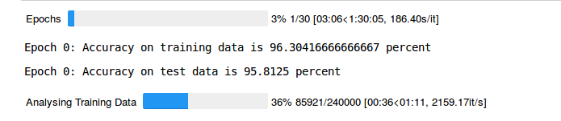

# neural-network

In this notebook we read the EMNIST data containing images of handwritten digits.

We build a neural network from scratch to successfully predict handwritten digits at an accuracy of 97%.

